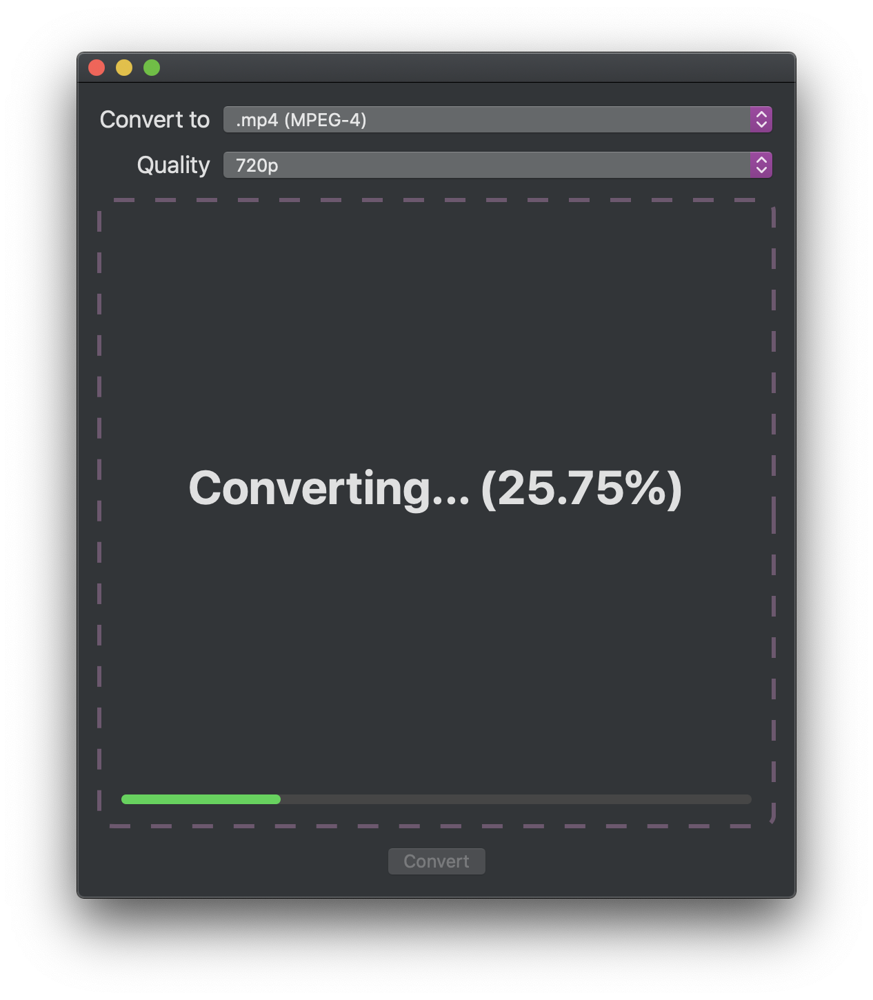

# Video Converter
A simple video converter for Mac.

This app is written with SwiftUI & Combine, implementing a unidirectional data
flow pattern with a View-State-Interactor structure.

## Screenshot

## License
[MIT](LICENSE)
